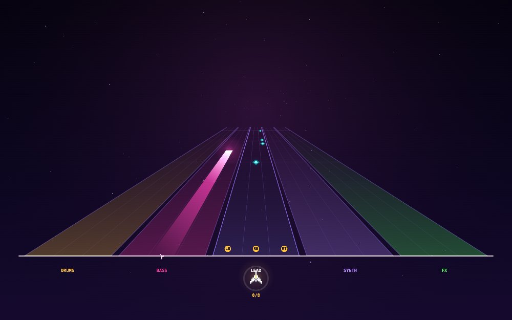

# KONTINUE? GAMES

A tiny browser arcade — voxel-built games you can play instantly, no install. A [Brivio Advisory OÜ](https://github.com/mauriziobrivio) production, made in Estonia.

### ▶ [Enter the arcade — kontinue.games](https://kontinue.games)



## Now playing

| Game | Genre | |
|---|---|---|
| **[NEONSTORM](https://kontinue.games/neonstorm/)** | Voxel twin-stick shooter | A Geometry Wars tribute — ten enemy types, three escalating bosses, a warping neon grid, and a global leaderboard. |
| **[PULSAR](https://kontinue.games/pulsar/)** | Rhythm / track shooter | A Frequency/Amplitude tribute — ride five instrument lanes, capture each stem to build the song. Original synth tracks, or drop in your own `.MOD` files. |
| **[RICOCHET](https://kontinue.games/ricochet/)** | Voxel block-breaker | An Arkanoid tribute — ten hand-built sectors, chaining bombs, lasers, multi-ball, hazard capsules to dodge, and a world leaderboard. |

*In development:* Stardust · GlowMaze · Fathom · Contrail.

## How it's built

Every game is a **single self-contained HTML file** — the renderer, physics, particles, music and SFX are all hand-rolled JavaScript with zero dependencies and no build step. Each one runs straight from disk or off the web.

```
index.html        ← the arcade landing page
neonstorm/        ← NEONSTORM
pulsar/           ← PULSAR
ricochet/         ← RICOCHET
CNAME             ← kontinue.games (GitHub Pages)
```

## Run locally

Clone and open `index.html`, or serve the folder with any static server and visit the root.

---

© 2026 Kontinue? Games — a Brivio Advisory OÜ production. Made with ♥ and too many voxels, with [Claude Code](https://claude.com/claude-code).
