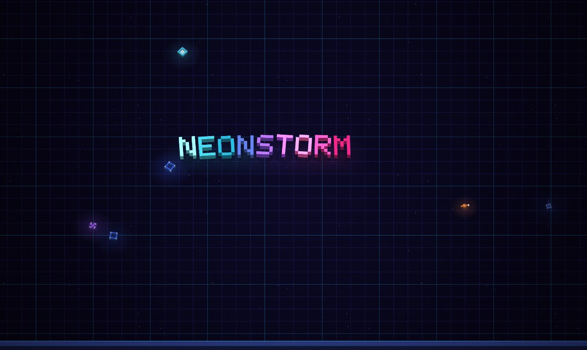

# GEO WARS // VOXEL

A twin-stick arena shooter in a single HTML file — a voxel-built tribute to Geometry Wars.
No dependencies, no build step, no assets: the renderer, physics, particles, music and SFX are all hand-rolled JavaScript.

### ▶ [Play it now](https://mauriziobrivio.github.io/geo-wars/)

## Controls

| Input | Action |
|---|---|
| `WASD` / arrows | Move |
| Mouse | Aim |
| Hold `LMB` / `Space` | Fire |
| `RMB` / `Shift` / `B` | Bomb |
| `P` / `Esc` | Pause |
| `M` | Mute |
| Gamepad | Full twin-stick support |

## What's inside

- **Ten enemy types** — grunts, wanderers, seekers, bullet-dodging weavers, flies, splitters, ricocheting rockets, proximity mines (they chain!), snakes, and gravity wells with genuinely dangerous pull physics.
- **Three escalating bosses** on a rotating cycle — SERPENT KING, SINGULARITY, HIVE QUEEN — each generation longer / larger / stronger than the last.
- **Wave director** that escalates continuously: rising population floor, wave bursts every 26 seconds, a boss every 4th wave.
- **Score multiplier** (×1–×10) that upgrades your guns and resets on death; extra ship at 200k, extra bomb at 300k, +1 bomb per boss kill.
- **Local top-10 high-score table** with arcade three-letter tags — plus a **global WORLD leaderboard** (Supabase REST via plain `fetch`, still zero libraries) with live world-rank announcements.
- **Voxel renderer** — every entity is a depth-sorted, per-face-lit stack of cubes on a tilted projection; enemies explode into physical voxel debris that bounces and gets swallowed by black holes.
- The iconic **warping grid**: a spring-mesh floor that ripples from every bullet, explosion, and gravity well.
- **Synthesized audio** — a 124 BPM sequencer (kick, hats, bass, arpeggio with sidechain ducking) plus all SFX generated in WebAudio.

## Run locally

Download `index.html` and double-click it. That's the whole game.

---

Built with [Claude Code](https://claude.com/claude-code).
